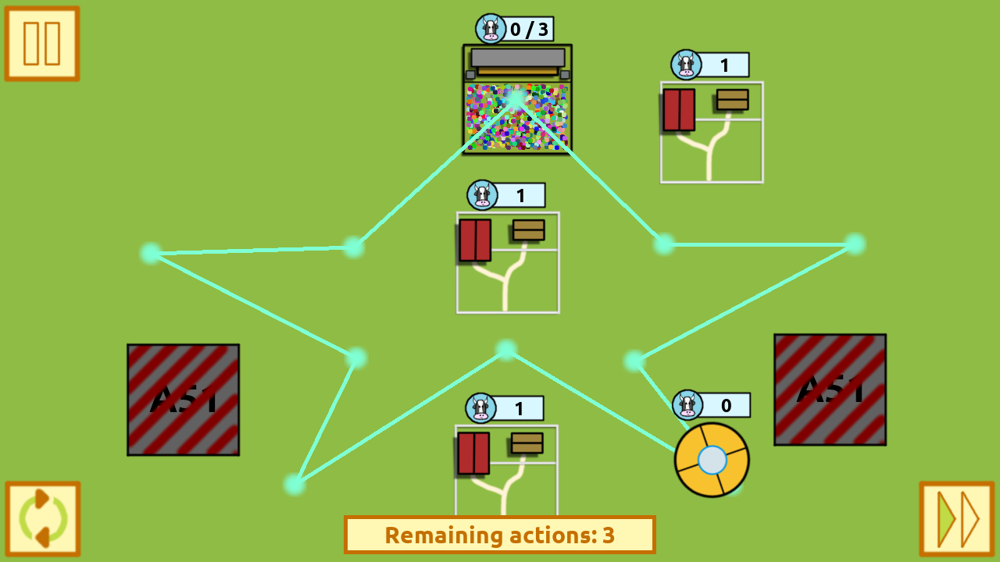

# UFO taxi!

It’s the great COW FESTIVAL and all the cows in the region want to go!

As an employee of the “UFO taxi!” company, you must take them to the festival safely. However your vehicle is stuck in a polygonal loop which doesn’t cover the cow farms. Luckily for you, the route can be modified…

Made for [Ludum Dare #47](https://ldjam.com/events/ludum-dare/47/) - Theme: "Stuck in a loop"

## Mechanics

The goal on each level is to modify the path followed by the UFO so it can pick cows from the farms and leave them at the festival.

- Click on a vertex and confirm for removing it.
- Drag and drop an edge for creating a new vertex.

## Links

- [Play "UFO taxi!" online](https://www.moisesjose.com/games/ufo-taxi/play)
- [Download "UFO taxi!" v0.3.1 for Windows](https://github.com/moisesjbc/ufo-taxi/releases/download/v0.3.1/ufo-taxi_windows_v0.3.1.zip)
- [Download "UFO taxi!" v0.3.1 for GNU/Linux](https://github.com/moisesjbc/ufo-taxi/releases/download/v0.3.1/ufo-taxi_linux_v0.3.1.zip)
- ["UFO taxi!" page at Ludum Dare #47"](https://ldjam.com/events/ludum-dare/47/ufo-taxi)
- ["UFO taxi!" page at itch.io](https://moisesjbc.itch.io/ufo-taxi)
- ["UFO taxi!" Github repository](https://github.com/moisesjbc/ufo-taxi)

## Credits

### Idea, programming, graphics, sounds 

- [Moisés J. Bonilla Caraballo (moisesjbc)](https://moisesjose.com)

### Fonts

- [Ubuntu font](https://design.ubuntu.com/font/)

### Software used

- [Godot engine](https://godotengine.org/)
- [Gimp](https://www.gimp.org/)
- [sfxr](http://www.drpetter.se/project_sfxr.html)
- [LMMS](https://lmms.io)

## Thanks

- The [Ludum Dare](https://ldjam.com/) organizers
- The people who rated and comented [my game on Ludum Dare #47](https://ldjam.com/events/ludum-dare/47/ufo-taxi) and encouraged me to extend it.
- [LeninGamers (Adrián, Christian and Omar)](https://www.twitch.tv/leningamers) 
- [Himar](https://www.facebook.com/sobrelamarcharockbandcovers)

# Development info

## Scripts

Directory scripts/ includes the following utility scripts:

### devel-html.sh

Mounts a simple webserver serving the game in localhost

        bash scripts/devel-html.sh

### update-version.sh

Updates version number in game (level files, main menu, etc)

        bash scripts/update-version.sh <version>

### Instantiate images (Ubuntu)

Sprites are created with a size N times bigger than the base resolution used in the game. This script reduces the sprites to the base resolution and place them in their corresponding directories in the Godot project directory:

        bash scripts/instantiate_images.sh

### Add GPL legal notices

Add the GPL legal notice to the begining of all source files (.gd)

        bash scripts/apply_gpl_notice.sh
